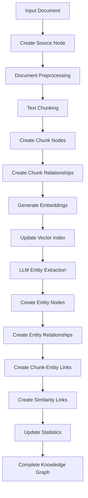

# LUỒNG HOẠT ĐỘNG XỬ LÝ DOCUMENT - LLM GRAPH BUILDER

## TỔNG QUAN WORKFLOW
Hệ thống LLM Graph Builder xử lý document theo 5 giai đoạn chính:
1. **Source Node Creation** - Tạo node nguồn
2. **Document Chunking** - Chia nhỏ document thành chunks
3. **Embedding Generation** - Tạo vector embeddings
4. **Entity Extraction** - Trích xuất entities và relationships
5. **Graph Construction** - Xây dựng knowledge graph

---

## CHI TIẾT TỪNG GIAI ĐOẠN

### 1. SOURCE NODE CREATION (Tạo Node Nguồn)
**File chính**: `backend/src/main.py`

#### 1.1 Khởi tạo Source Node
```python
obj_source_node = sourceNode()
obj_source_node.file_name = file_name
obj_source_node.file_type = 'pdf'/'text'
obj_source_node.file_source = source_type  # local/s3/gcs/web/youtube/wikipedia
obj_source_node.model = model              # LLM model to use
obj_source_node.url = source_url
obj_source_node.file_size = file_size
obj_source_node.created_at = datetime.now()
```

#### 1.2 Lưu vào Neo4j
- **Phương thức**: `graphDB_dataAccess.create_source_node(obj_source_node)`
- **File**: `backend/src/graphDB_dataAccess.py`
- **Chức năng**: Tạo `:Document` node trong Neo4j với metadata

---

### 2. DOCUMENT CHUNKING (Chia Document)
**File chính**: `backend/src/create_chunks.py`

#### 2.1 Preprocessing Document
```python
# Làm sạch text
bad_chars = ['"', "\n", "'"]
for char in bad_chars:
    if char == '\n':
        text = text.replace(char, ' ')
    else:
        text = text.replace(char, '')
```

#### 2.2 Chunking Process
```python
create_chunks_obj = CreateChunksofDocument(pages, graph)
chunks = create_chunks_obj.split_file_into_chunks(token_chunk_size, chunk_overlap)
```

**Các bước chunking**:
1. **Text Splitting**: Sử dụng `RecursiveCharacterTextSplitter`
   - `chunk_size` = token_chunk_size (default: 512)
   - `chunk_overlap` = chunk_overlap (default: 50)

2. **Chunk Creation**: Tạo chunks với metadata
   ```python
   chunk_doc = Document(
       page_content=chunk_text,
       metadata={
           'id': chunk_id,
           'position': position,
           'source': file_name
       }
   )
   ```

#### 2.3 Relationship Creation Between Chunks
```python
chunkId_chunkDoc_list = create_relation_between_chunks(graph, file_name, chunks)
```

**Tạo các relationships**:
- **PART_OF**: Chunk → Document
- **FIRST_CHUNK**: Document → First Chunk  
- **NEXT_CHUNK**: Previous Chunk → Next Chunk
- **LAST_CHUNK**: Document → Last Chunk

---

### 3. EMBEDDING GENERATION (Tạo Vector Embeddings)
**File chính**: `backend/src/main.py` → `create_chunk_embeddings()`

#### 3.1 Vector Index Creation
```python
create_chunk_vector_index(graph)
```

#### 3.2 Embedding Process
```python
create_chunk_embeddings(graph, chunkId_chunkDoc_list, file_name)
```

**Các bước**:
1. **Text Embedding**: Sử dụng LLM để tạo vector embeddings
2. **Update Chunk Nodes**: Cập nhật property `embedding` cho `:Chunk` nodes
3. **Vector Index**: Thêm vào vector index để tìm kiếm similarity

---

### 4. ENTITY EXTRACTION (Trích Xuất Entities)
**File chính**: `backend/src/llm.py`

#### 4.1 LLM Graph Extraction
```python
graph_documents = await get_graph_from_llm(
    model, 
    chunkId_chunkDoc_list, 
    allowedNodes, 
    allowedRelationship, 
    chunks_to_combine, 
    additional_instructions
)
```

#### 4.2 Entity và Relationship Extraction
**Quá trình**:
1. **Combine Chunks**: Kết hợp nhiều chunks (theo `chunks_to_combine`)
2. **LLM Processing**: Gửi combined text tới LLM
3. **Schema Extraction**: Trích xuất theo schema định sẵn
4. **Entity Recognition**: Nhận diện entities (Person, Organization, Location, Event, etc.)
5. **Relationship Identification**: Xác định relationships giữa entities

#### 4.3 Clean và Validate
```python
cleaned_graph_documents = handle_backticks_nodes_relationship_id_type(graph_documents)
```

---

### 5. GRAPH CONSTRUCTION (Xây Dựng Graph)
**File chính**: `backend/src/main.py`, `backend/src/graphDB_dataAccess.py`

#### 5.1 Save Graph Documents
```python
save_graphDocuments_in_neo4j(graph, cleaned_graph_documents)
```

**Tạo nodes và relationships**:
- **Entity Nodes**: Person, Organization, Location, Event, etc.
- **Entity Relationships**: Relationships giữa entities

#### 5.2 Chunk-Entity Relationships
```python
chunks_and_graphDocuments_list = get_chunk_and_graphDocument(cleaned_graph_documents, chunkId_chunkDoc_list)
merge_relationship_between_chunk_and_entites(graph, chunks_and_graphDocuments_list)
```

**Tạo relationships**:
- **HAS_ENTITY**: Chunk → Entity

#### 5.3 Similarity Relationships
```python
graph_DB_dataAccess.update_KNN_graph()
```

**SIMILAR relationship creation**:
- Sử dụng vector similarity search
- Cosine similarity với threshold `KNN_MIN_SCORE`
- Tạo **SIMILAR** relationships giữa các chunks tương tự

---

## CÁC LOẠI RELATIONSHIPS ĐƯỢC TẠO

### System Relationships (Cấu trúc)
1. **PART_OF**: Chunk → Document
2. **FIRST_CHUNK**: Document → First Chunk
3. **NEXT_CHUNK**: Previous Chunk → Next Chunk  
4. **LAST_CHUNK**: Document → Last Chunk
5. **HAS_ENTITY**: Chunk → Entity
6. **SIMILAR**: Chunk → Chunk (cosine similarity)

### Application Relationships (Nội dung)
7. **WORKS_FOR**: Person → Organization
8. **LOCATED_IN**: Entity → Location
9. **PARTICIPATED_IN**: Person → Event
10. **OWNS**: Person → Organization
11. **MANAGES**: Person → Organization
12. **FOUNDED**: Person → Organization
13. **Dynamic relationships**: Được LLM trích xuất dựa trên nội dung

---

## CÁC LOẠI SOURCE TYPES HỖ TRỢ

### 1. Local File (`create_source_node_graph_local_file`)
- **File types**: PDF, text files
- **Processing**: Đọc từ local file system
- **Metadata**: file_name, file_size, file_type

### 2. S3 Bucket (`create_source_node_graph_url_s3`)
- **File types**: PDF files từ AWS S3
- **Authentication**: aws_access_key_id, aws_secret_access_key
- **Metadata**: S3 bucket info, file_key

### 3. GCS Bucket (`create_source_node_graph_url_gcs`)
- **File types**: PDF files từ Google Cloud Storage
- **Authentication**: GCS credentials
- **Metadata**: gcs_project_id, gcs_bucket_name, gcs_bucket_folder

### 4. Web Pages (`create_source_node_graph_web_url`)
- **File types**: Web content (HTML)
- **Processing**: Sử dụng WebBaseLoader
- **Metadata**: title, language, URL

### 5. YouTube (`create_source_node_graph_url_youtube`)
- **File types**: YouTube transcript
- **Processing**: Trích xuất transcript từ YouTube API
- **Metadata**: video_id, transcript_text

### 6. Wikipedia (`create_source_node_graph_url_wikipedia`)
- **File types**: Wikipedia articles
- **Processing**: Sử dụng WikipediaLoader
- **Metadata**: wiki_query, article_content

---

## WORKFLOW TỔNG THỂ



---

## CÁC THAM SỐ QUAN TRỌNG

### Chunking Parameters
- **token_chunk_size**: 512 (default)
- **chunk_overlap**: 50 (default)
- **chunks_to_combine**: Số chunks kết hợp cho LLM

### Vector Similarity
- **KNN_MIN_SCORE**: Threshold cho similarity (default: 0.8)
- **vector_index**: "vector" (index name)

### Processing Control
- **UPDATE_GRAPH_CHUNKS_PROCESSED**: Số chunks xử lý trong 1 batch
- **retry_condition**: START_FROM_BEGINNING/START_FROM_LAST_PROCESSED_POSITION/DELETE_ENTITIES_AND_START_FROM_BEGINNING

---

## ERROR HANDLING VÀ RETRY MECHANISM

### Retry Conditions
1. **START_FROM_BEGINNING**: Xử lý lại từ đầu
2. **START_FROM_LAST_PROCESSED_POSITION**: Tiếp tục từ vị trí đã xử lý
3. **DELETE_ENTITIES_AND_START_FROM_BEGINNING**: Xóa entities và bắt đầu lại

### Status Tracking
- Document node có status: "Processing", "Completed", "Failed"
- Theo dõi `processed_chunk` position
- Cancel mechanism: `is_cancelled` flag

---

## PERFORMANCE MONITORING

Hệ thống track thời gian cho từng bước:
- Database connection time
- Chunking time  
- Embedding generation time
- Entity extraction time
- Graph saving time
- Relationship creation time

Tất cả được lưu trong `uri_latency` để phân tích performance.
